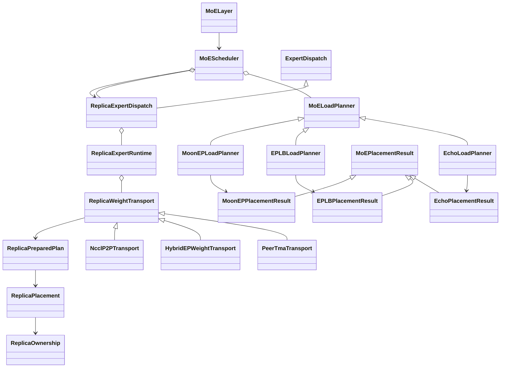

<div align="center">

Megatron-LM & Megatron Core
===========================

<h4>GPU-optimized library for training transformer models at scale</h4>

[](https://docs.nvidia.com/Megatron-Core/developer-guide/latest/index.html)
[](./CHANGELOG.md)
[](./LICENSE)

<div align="left">

> ## 🚨 **DEVELOPMENT BRANCH**
> ⚠️ **EXPERIMENTAL FEATURES** - This is the **dev branch** with experimental features. 
>
> **→ For releases and comprehensive documentation, visit the [main branch](https://github.com/NVIDIA/Megatron-LM)**

## ⚡ Quickstart

```bash
# Clone the dev branch
git clone -b dev https://github.com/NVIDIA/Megatron-LM.git
cd Megatron-LM

# Install from source with dev dependencies (includes transformer_engine)
pip install -e .[mlm,dev]
```

**Megatron Core** is a composable library with GPU-optimized building blocks for custom training frameworks. It provides transformer building blocks, advanced parallelism strategies (TP, PP, DP, EP, CP), mixed precision support (FP16, BF16, FP8, FP4), and model architectures. Best for framework developers and ML engineers building custom training pipelines.

**[Megatron Bridge](https://github.com/NVIDIA-NeMo/Megatron-Bridge)** provides bidirectional Hugging Face ↔ Megatron checkpoint conversion with production-ready recipes.

## Getting Started

**Install from PyPI:**

```bash
uv pip install megatron-core
```

**Or clone and install from source:**

```bash
git clone https://github.com/NVIDIA/Megatron-LM.git
cd Megatron-LM
uv pip install -e .
```

> **Note:** Building from source can use a lot of memory. If the build runs out of memory, limit parallel compilation jobs by setting `MAX_JOBS` (e.g. `MAX_JOBS=4 uv pip install -e .`).

For NGC container setup and all installation options, see the **[Installation Guide](https://docs.nvidia.com/megatron-core/developer-guide/latest/get-started/install.html)**.

- **[Your First Training Run](https://docs.nvidia.com/megatron-core/developer-guide/latest/get-started/quickstart.html)** - End-to-end training examples with data preparation
- **[Parallelism Strategies](https://docs.nvidia.com/megatron-core/developer-guide/latest/user-guide/parallelism-guide.html)** - Scale training across GPUs with TP, PP, DP, EP, and CP
- **[Contribution Guide](https://docs.nvidia.com/megatron-core/developer-guide/latest/developer/contribute.html)** - How to contribute to Megatron Core

# Latest News

- **[2026/03]** **Deprecating Python 3.10 support:** We're officially dropping Python 3.10 support with the upcoming 0.17.0 release. Downstream applications must raise their lower boundary to 3.12 to stay compatible with MCore.
- **[2026/01]** **[Dynamic Context Parallelism](https://developer.nvidia.com/blog/speeding-up-variable-length-training-with-dynamic-context-parallelism-and-nvidia-megatron-core/)** - Up to 1.48x speedup for variable-length sequence training with adaptive CP sizing.
- **[2025/12]** **Megatron Core development has moved to GitHub!** All development and CI now happens in the open. We welcome community contributions.
- **[2025/10]** **[Megatron Dev Branch](https://github.com/NVIDIA/Megatron-LM/tree/dev)** - early access branch with experimental features.
- **[2025/10]** **[Megatron Bridge](https://github.com/NVIDIA-NeMo/Megatron-Bridge)** - Bidirectional converter for interoperability between Hugging Face and Megatron checkpoints, featuring production-ready recipes for popular models.
- **[2025/08]** **[MoE Q3-Q4 2025 Roadmap](https://github.com/NVIDIA/Megatron-LM/issues/1729)** - Comprehensive roadmap for MoE features including DeepSeek-V3, Qwen3, advanced parallelism strategies, FP8 optimizations, and Blackwell performance enhancements.
- **[2025/08]** **[GPT-OSS Model](https://github.com/NVIDIA/Megatron-LM/issues/1739)** - Advanced features including YaRN RoPE scaling, attention sinks, and custom activation functions are being integrated into Megatron Core.
- **[2025/06]** **[Megatron MoE Model Zoo](https://github.com/yanring/Megatron-MoE-ModelZoo)** - Best practices and optimized configurations for training DeepSeek-V3, Mixtral, and Qwen3 MoE models with performance benchmarking and checkpoint conversion tools.
- **[2025/05]** Megatron Core v0.11.0 brings new capabilities for multi-data center LLM training ([blog](https://developer.nvidia.com/blog/turbocharge-llm-training-across-long-haul-data-center-networks-with-nvidia-nemo-framework/)).

<details>
<summary>Table of Contents</summary>

**Getting Started**
- [⚡ Quick Start](#-quick-start)
- [🧠 Dev Branch Philosophy](#-dev-branch-philosophy)
- [MoE Scheduler](#moe-scheduler-experimental)
- [📊 Performance & Benchmarking](#-performance--benchmarking)
- [👥 Community & Support](#-community--support)

**For Complete Documentation** → [Main Branch](https://github.com/NVIDIA/Megatron-LM) | [Official Docs](https://docs.nvidia.com/Megatron-Core/)

</details>


## Dev Branch Philosophy

# Project Structure

```
Megatron-LM/
├── megatron/
│   ├── core/                    # Megatron Core (kernels, parallelism, building blocks)
│   │   ├── models/              # Transformer models
│   │   ├── transformer/         # Transformer building blocks
│   │   ├── tensor_parallel/     # Tensor parallelism
│   │   ├── pipeline_parallel/   # Pipeline parallelism
│   │   ├── distributed/         # Distributed training (FSDP, DDP)
│   │   ├── optimizer/           # Optimizers
│   │   ├── datasets/            # Dataset loaders
│   │   ├── inference/           # Inference engines and server
│   │   └── export/              # Model export (e.g. TensorRT-LLM)
│   ├── training/                # Training scripts
│   ├── legacy/                  # Legacy components
│   ├── post_training/           # Post-training (quantization, distillation, pruning, etc.)
│   └── rl/                      # Reinforcement learning (RLHF, etc.)
├── examples/                    # Ready-to-use training examples
├── tools/                       # Utility tools
├── tests/                       # Comprehensive test suite
└── docs/                        # Documentation
```

# MoE Scheduler (Experimental)

MoE Scheduler addresses load imbalance in dropless MoE models by replicating
hot logical experts into idle physical expert slots and rerouting tokens to the
replicas. It is designed as a preprocessing stage between router output and the
existing Megatron token dispatcher.

The scheduler does not introduce planner-specific branches into the remaining
MoE execution path. After scheduling, `MoELayer` continues through its normal
token preprocessing, dispatch, expert computation, combine, and backward flow.

## Design Goals

- Decouple load planning from expert-weight movement so planners and expert
  dispatch backends can be combined through one contract.
- Keep backend-native state, such as Echo offloading maps, EPLB replica tables,
  and MoonEP replica plans, private to concrete implementations.
- Split placement from token rerouting so asynchronous expert-weight dispatch
  can overlap reroute work without exposing planner-specific state.
- Make planners return final token reroute tensors so token dispatchers do not
  need to understand the selected planning algorithm.
- Return the original router output unchanged when the planner gate decides
  that no planning is required.
- Keep the public planner/dispatcher boundary small enough to lower efficiently
  into different expert communication backends.

## Architecture

| Component | Responsibility |
| --- | --- |
| `SchedulerContext` | Carries layer, logical/local expert, EP rank/group, router top-k, training mode, and configuration context. |
| `MoEPlacementResult` | Opaque, explicit state passed between a planner's placement and reroute phases. |
| `MoELoadPlanner` | Gates planning, updates the physical layout, and reroutes tokens against that placement. |
| `ExpertDispatch` | Validates/materializes a physical placement and owns forward/backward lifecycle hooks. |
| `MoEScheduler` | Orchestrates placement, asynchronous expert materialization, and token rerouting. |
| `MoELayer` | Invokes the scheduler between routing and token preprocessing. |

The planner contract is split into two phases:

```python
physical_to_logical_map, placement_result = planner.update_placement(
    probs, routing_map, context
)
routing_map, probs = planner.reroute(
    probs, routing_map, placement_result, context
)
```

`physical_to_logical_map` always means rank-major physical slot to logical
expert id, with `-1` marking an unused slot. `placement_result` is a concrete
planner's explicit intermediate state; the scheduler treats it as opaque and
passes it back only to the planner that produced it. `reroute()` returns dense
`[num_tokens, num_physical_experts]` routing and probability tensors.

The `ReplicaExpertDispatch` consumes only
`physical_to_logical_map` and owns the common weight-prefetch and
gradient-reduction lifecycle. It delegates TE/GTP parameter state to
`ReplicaExpertRuntime`, which delegates communication and transport-owned
storage to `ReplicaWeightTransport`.

## Class Diagram



The same architecture is available as standalone PlantUML sources:

- [MoEScheduler class diagram](docs/diagrams/moe_scheduler_class.puml)
- [MoEScheduler forward/backward activity diagram](docs/diagrams/moe_scheduler_activity.puml)

## Implemented Components

| Type | Config value | Implementation | Status |
| --- | --- | --- | --- |
| Planner | `echo` | `EchoLoadPlanner` | CUDA/Triton assignment and token reroute aligned with Echo PR #2368. |
| Planner | `eplb` | `EPLBLoadPlanner` | Greedy hot-expert replication, fixed-home LPT placement, and global round-robin rerouting. |
| Planner | `moon_ep` | `MoonEPLoadPlanner` | PR #6892 fused per-step placement: one cooperative kernel with symmetric-memory histogram exchange. |
| Expert dispatch | `replica_peer_tma` | `ReplicaExpertDispatch` | One replica lifecycle implementation; the type currently selects `PeerTmaTransport`. |
| Expert dispatch | `replica_hybridep` | Same dispatcher, `HybridEPWeightTransport` | Placeholder; raises `NotImplementedError` before transport allocation. |
| Expert dispatch | `replica_nccl` | Same dispatcher, `NcclP2PTransport` | Packed NCCL P2P; BF16 weights, BF16/FP32 gradients, host planning. |

UltraEP is a planned integration. It should implement the same common planner
output or expert-dispatch input semantics instead of exposing UltraEP-native
metadata in the public interface.

## Execution Flow

1. The dispatcher wraps the MoE layer input when backward work must complete
   after router, shared-expert, and latent-projection backward.
2. The router produces logical-expert `probs` and `routing_map`.
3. `MoELayer` calls `MoEScheduler.schedule()`.
4. `MoELoadPlanner.should_plan()` decides whether scheduling is needed.
5. If planning is skipped, the original router tensors are returned unchanged.
6. Otherwise, `update_placement()` returns `physical_to_logical_map` plus an
   opaque `MoEPlacementResult`.
7. `ExpertDispatch` lowers the placement map and asynchronously starts replica
   weight materialization on the destination ranks.
8. `reroute()` converts the original logical routes to physical routes while
   expert-weight communication is in flight.
9. The existing token dispatcher consumes the physical routing tensors and
   runs the normal dispatch, expert compute, and combine stages.
10. During backward, the replica runtime starts FC2 reduction directly behind
   its wgrad GEMM, starts pending FC1/FC2 reductions after dispatch backward,
   and waits at the layer input before publishing source gradients.

## Configuration

A minimal Echo configuration is:

```yaml
moe_enable_scheduler: true
moe_scheduler_planner_type: echo
moe_scheduler_expert_dispatcher_type: replica_peer_tma
moe_scheduler_num_idle_experts: 4
moe_scheduler_assignment_algorithm: approx_bin_packing
```

**Configuration migration:** the former `replica_hybridep` value selected
Peer-TMA, despite its name. It has been renamed to `replica_peer_tma`, which
is also the default. Update existing YAML/CLI configurations to that value.
`replica_hybridep` is now reserved for the actual HybridEP weight backend and
fails with a migration message; it never silently selects a different data
path. All three values construct `ReplicaExpertDispatch` from
`replica_expert_dispatch.py`; the common dispatcher has no transport-specific
name or compatibility alias. The HybridEP placeholder is accepted by
configuration validation but cannot execute or bind weights.

Set `moe_scheduler_expert_dispatcher_type: replica_nccl` to use packed NCCL
P2P with BF16 weights and BF16 or FP32 gradient storage. It requires an
initialized NCCL EP group and the current CUDA device to match the runtime
device. Construction is collective across that group. MXFP8 and CUDA graph
capture including MoE are rejected; attention-only graphs remain supported.

For MoonEP, set `moe_scheduler_planner_type: moon_ep`. The current MoonEP
implementation allocates one replica slot for every home expert, so
`moe_scheduler_num_idle_experts` must equal `num_moe_experts`.

For EPLB, set `moe_scheduler_planner_type: eplb`. `EPLBLoadPlanner` gathers the
current logical-expert loads across the EP group, greedily assigns redundant
instances according to `load / replica_count`, and LPT-packs those instances
into the fixed replica slots. It follows the core replication and packing
policy of [DeepSeek EPLB](https://github.com/deepseek-ai/EPLB), while retaining
rank-major home experts for compatibility with the common replica dispatcher.

All planners use the transport-backed `ReplicaExpertRuntime`. It supports an
`E + R` runtime layout, where `R` is positive and divisible by the EP size.
Every rank owns `E / EP` native experts followed by `R / EP` replica slots. It
requires the HybridEP flex token dispatcher, BF16 execution, TE grouped GEMM
with the operation fuser, and fused gradient accumulation. With Peer-TMA, weights may be BF16
or native-parameter MXFP8 E4M3; FP4 and other FP8 recipes are rejected. The
current `replica_peer_tma` type selects `PeerTmaTransport`, which requires a
single NVLink domain and a PyTorch/NCCL build with working native NCCL
symmetric-memory support.

Current constraints:

- Dropless MoE only; expert capacity and capacity padding must be disabled.
- `num_moe_experts` and `moe_scheduler_num_idle_experts` must be divisible by
  the expert-model-parallel size.
- `add_bias_linear` must be disabled.
- The `replica_peer_tma` expert dispatcher requires discrete native expert
  weights and the Transformer Engine operation fuser; single grouped expert
  weights are unsupported.
- The HybridEP flex token dispatcher requires a build with HybridEP support.
- The MoonEP planner requires CUDA, initialized EP distributed groups, and one
  replica slot per local home expert. Its current #6892 planner uses one fused
  cooperative kernel and an NCCL symmetric-memory histogram window.
- The EPLB planner currently uses the current step's EP-global token counts and
  global placement rather than a historical moving-average load predictor or
  hierarchical multi-node expert-group placement.
- CUDA graph capture is supported only at the whole-MoE scope for
  `replica_peer_tma`; separate `moe_router` and `moe_preprocess` scopes are
  rejected. MoE activation recompute is also rejected for this lifecycle.
- When GTP exposes #6892's non-consuming peek protocol, the weight push peeks
  at gathered weights and the expert GEMMs perform the real consume. Older GTP
  implementations retain the pre-existing consume-at-push compatibility path.

Rank 0 logs the configured planner, dispatcher, idle expert count, and
assignment algorithm at startup. The first scheduled forward also logs routing
shapes, physical expert and transfer counts, and whether planning and expert
materialization ran.

## Code Map

| Path | Purpose |
| --- | --- |
| `megatron/core/transformer/moe/moe_scheduler.py` | Shared two-phase planner interfaces and scheduler orchestration. |
| `megatron/core/transformer/moe/echo_moe_scheduler.py` | Echo planner and Triton reroute path. |
| `megatron/core/transformer/moe/eplb_moe_scheduler.py` | EPLB greedy replication, fixed-home LPT placement, and round-robin reroute. |
| `megatron/core/transformer/moe/moonep_moe_scheduler.py` | MoonEP/PR #6892 planner adapter and common-IR conversion. |
| `megatron/core/transformer/moe/moonep_replica_triton.py` | #6892 histogram/placement and route-mapping Triton kernels. |
| `megatron/core/transformer/moe/replica_expert_dispatch.py` | Common placement adapter and replica forward/backward lifecycle. |
| `megatron/core/transformer/moe/replica_expert_runtime.py` | TE/GTP runtime weights, gradient handoff, and transport coordination. |
| `megatron/core/transformer/moe/replica_weight_transport.py` | Backend-neutral replica weight/gradient transport contract and factory. |
| `megatron/core/transformer/moe/replica_peer_tma_transport.py` | Symmetric-memory peer-TMA transport and shared workspace. |
| `megatron/core/transformer/moe/replica_hybridep_transport.py` | Reserved HybridEP weight backend; not implemented. |
| `megatron/core/transformer/moe/replica_nccl_transport.py` | Packed NCCL P2P, host schedules, and FP32 gradient accumulation. |
| `megatron/core/transformer/moe/replica_weight_triton.py` | #6892 weight transport and projection-selective gradient-reduction kernels, generalized to variable replica slots. |
| `megatron/core/transformer/moe/moe_layer.py` | Integration between logical routing and the existing token dispatcher. |
| `megatron/core/transformer/transformer_config.py` | Scheduler configuration and compatibility validation. |
| `tests/unit_tests/transformer/moe/test_moe_scheduler.py` | Common contract and orchestration tests. |
| `tests/unit_tests/transformer/moe/test_echo_moe_scheduler.py` | Echo planner, unified replica dispatch, and `MoELayer` integration tests. |
| `tests/unit_tests/transformer/moe/test_eplb_moe_scheduler.py` | EPLB placement, global reroute, gradient, and factory tests. |
| `tests/unit_tests/transformer/moe/test_moonep_moe_scheduler.py` | MoonEP planner and cross-component compatibility tests. |
| `tests/unit_tests/transformer/moe/test_replica_weight_transport.py` | Plan ownership, layout, completion lifetime, and placeholder contracts. |
| `tests/unit_tests/transformer/moe/test_replica_nccl_transport.py` | NCCL weight/gradient parity, strided EP subgroups, empty ranks, and stream completion. |

## Replica Transport Contract

The planner chooses logical experts for execution slots. The single dispatcher
retains an immutable placement slot through forward/backward and assigns a
dispatcher-local generation. `ReplicaExpertRuntime` wraps that slot table in
`ReplicaPlacement`, with a separate `ReplicaOwnership` descriptor. The current
owner mapping is uniform and fixed; optional explicit owner tables reserve an
extension point and are rejected by Peer-TMA and NCCL P2P. This refactor does not implement
native-owner or optimizer-state migration, or relax the fixed-home E+R layout.

`transport.prepare_plan(placement)` produces a `ReplicaPreparedPlan` belonging
to that exact transport instance. Peer-TMA keeps device metadata; NCCL
compiles host peer schedules, while a future HybridEP implementation can
compile chunk routing. The common layer never expands chunk routing or reads the
placement back to the CPU. Runtime caches are weak and keyed by plan identity,
not the address of a recycled slot. A future host-scheduled backend must
document synchronization and reject unsupported graph capture. CUDA graph
replay can update device metadata without executing Python or incrementing a
Python generation: cached host schedules must never assume otherwise.

Each `ReplicaWeightSource` exposes canonical local-expert data and optional
scales, with explicit plain/rowwise/columnwise layout. Tensor shape and dtype
describe the components; wire encoding and packing belong to the transport.
Optional pointer tables remain a Peer-TMA fast path. TE wrappers, GTP peeks,
direction selection and optimizer handoff remain in the runtime.

Each start returns a distinct `ReplicaTransferHandle`, separate from reusable
scheduling metadata. A weight completion covers unpack and final layout;
a gradient completion covers `native += sum(replicas)`, including local
replicas, with FP32 accumulation and one final cast. Native gradients are not
cleared. Reduction order can differ between backends; bitwise equivalence is
not promised. Every wait orders its calling stream, including repeated waits
for resident weights. Handles retain operation inputs, but backends must also
protect allocator lifetimes and callers must not overwrite sources or buffers
while the GPU uses them.

Storage views remain stable until teardown. The existing Peer-TMA shared
workspace and its serialized layer lifecycle are preserved; the interface
does not promise independent concurrent storage per layer. New transports
should first use per-layer buffers before introducing shared pools. Only
initialized backends register finalizers, so cleanup does not import unused
Triton/symmetric-memory dependencies. Capabilities advertise implemented
weight formats, gradient dtypes, device planning, graph support and explicit
ownership; placeholders advertise none. Topology compatibility remains a
backend initialization requirement, not an automatic fallback policy.

NCCL P2P can move weights across nodes without symmetric-memory allocation.
Full scheduler execution also requires compatible planner and token-dispatch paths; current scheduler
configuration still requires HybridEP tokens and the MoonEP planner still
uses symmetric-memory histogram exchange.

## NCCL P2P Transport Design

The initial NCCL backend supports plain BF16 weights and either BF16 or FP32
replica/native gradient storage. It does not import Peer-TMA, Triton, or
symmetric-memory helpers. TE parameter wrappers, GTP materialization, backward
weight selection and optimizer handoff remain in `ReplicaExpertRuntime`.

`prepare_plan()` performs one synchronous device-to-host copy of the global
`[EP, replica_slots]` placement per immutable microbatch plan. It validates
logical expert IDs, skips `-1`, and derives owners using uniform canonical
ownership. The prepared schedule stores only peer ranks, native indices and
replica slots. It never retains source addresses, so backward may use newly
materialized weights. All ranks must provide the same placement; no extra
placement or count exchange occurs in the steady-state path.

For weights, each owner packs both projections into one contiguous BF16
message per destination, ordered by projection and destination slot. Batched
`isend`/`irecv` operations use global ranks translated from EP ranks and a
consistent directed-edge ordering. Local replicas use device copies. The
receiver unpacks into stable, layer-local replica storage. Duplicate experts
in distinct slots are currently sent separately; unused slots are untouched.

Gradients follow the same routes in reverse, only for the requested
projections. The owner adds local and received replica gradients to the
existing native gradient in FP32, then casts once into the supplied native
gradient destinations. Unreferenced native experts remain untouched. FC2 and
FC1 can start separately, preserving the runtime's FC2-first backward order.

Each layer owns its storage and one communication stream. A start waits for
its producer stream, packs messages, submits batched P2P, waits on NCCL Work
objects on the communication stream, and enqueues unpack or accumulation.
The returned event covers all of that work. Every wait inserts an event wait
on its calling stream, including repeated waits on different streams. Normal
NCCL waits order GPU work; enabling NCCL blocking-wait settings can also block
the host. Temporary buffers and input references are retained internally
until the event completes, even if the caller drops the handle. Tensor stream
tracking protects allocator reuse. Callers must still order consumers before
explicitly overwriting sources or reusable replica storage.

Construction must run in matching order on every EP member. It performs a
small all-reduce on the borrowed NCCL group before any sparse batched P2P, so
ranks without traffic need not participate in subsequent P2P batches. All
layers and other users of the same group must maintain matching communication
submission order. `destroy()` drains this layer's communication stream and
releases layer-local storage, without destroying the borrowed group.

Capabilities are conservative: host planning and dynamic message sizes mean
`device_plan=False`, `cuda_graph=False`, and `explicit_ownership=False`.
Both plan preparation and operation starts reject CUDA capture, even for
plans prepared before capture. `num_sms` is unused because the backend does
not expose a portable per-operation NCCL SM limit. Future optimizations can
add peer-local deduplication, reusable staging pools, and fused pack/reduce
kernels after measuring the baseline. MXFP8 data/scale transfer and static
CUDA-graph schedules require separate implementations and validation.

## Extending MoE Scheduler

To add a planner:

1. Subclass `MoELoadPlanner` and implement `update_placement()`, `reroute()`,
   and, when needed, `should_plan()`.
2. Return `physical_to_logical_map` plus a `MoEPlacementResult` subclass from
   `update_placement()`. Keep backend-specific allocation state in that result.
3. Return dense physical `routing_map` and `probs` from `reroute()`.
4. Register the planner in `MoEScheduler.from_config()` and
   `TransformerConfig` validation.
5. Add contract tests and at least one planner/dispatcher compatibility test.

To add a replica communication mode while retaining the single expert dispatcher:

1. Implement `ReplicaWeightTransport`, including transport-owned storage views.
2. Keep TE, GTP, MXFP8, and optimizer semantics in `ReplicaExpertRuntime`.
3. Register the transport against an expert-dispatch type in
   `create_replica_weight_transport()`; all types instantiate
   `ReplicaExpertDispatch`.
4. Compile only backend-private schedules in `prepare_plan()` and preserve
   layout, ownership, storage lifetime and asynchronous completion semantics.
5. Add factory, forward/backward lifecycle, and multi-rank correctness tests.

Run the focused unit tests from the Megatron-LM repository root:

```bash
python -m torch.distributed.run --nproc-per-node 8 -m pytest \
  tests/unit_tests/transformer/moe/test_replica_weight_transport.py \
  tests/unit_tests/transformer/moe/test_replica_nccl_transport.py \
  tests/unit_tests/transformer/moe/test_moe_scheduler.py \
  tests/unit_tests/transformer/moe/test_echo_moe_scheduler.py \
  tests/unit_tests/transformer/moe/test_eplb_moe_scheduler.py \
  tests/unit_tests/transformer/moe/test_moonep_moe_scheduler.py
```

# Performance Benchmarking

For our latest performance benchmarking results, please refer to [NVIDIA Megatron Bridge Performance Summary](https://docs.nvidia.com/nemo/megatron-bridge/latest/performance-summary.html).

Our codebase efficiently trains models from 2B to 462B parameters across thousands of GPUs, achieving up to **47% Model FLOP Utilization (MFU)** on H100 clusters.


**Benchmark Configuration:**

- **Vocabulary size**: 131,072 tokens
- **Sequence length**: 4096 tokens
- **Model scaling**: Varied hidden size, attention heads, and layers to achieve target parameter counts
- **Communication optimizations**: Fine-grained overlapping with DP (`--overlap-grad-reduce`, `--overlap-param-gather`), TP (`--tp-comm-overlap`), and PP (enabled by default)

**Key Results:**

- **6144 H100 GPUs**: Successfully benchmarked 462B parameter model training
- **Superlinear scaling**: MFU increases from 41% to 47-48% with model size
- **End-to-end measurement**: Throughputs include all operations (data loading, optimizer steps, communication, logging)
- **Production ready**: Full training pipeline with checkpointing and fault tolerance
- *Note: Performance results measured without training to convergence*

## Weak Scaling Results

Our weak scaled results show superlinear scaling (MFU increases from 41% for the smallest model considered to 47-48% for the largest models); this is because larger GEMMs have higher arithmetic intensity and are consequently more efficient to execute.


## Strong Scaling Results

We also strong scaled the standard GPT-3 model (our version has slightly more than 175 billion parameters due to larger vocabulary size) from 96 H100 GPUs to 4608 GPUs, using the same batch size of 1152 sequences throughout. Communication becomes more exposed at larger scale, leading to a reduction in MFU from 47% to 42%.


# Roadmaps

### Fast Iteration
- **Streamlined Review**: 1 code owner + 1 dev approver (can delegate review) + CI/CD

### Feature Lifecycle (Coming Soon)
- **6-Month Timeline**: Experimental features must graduate to stable or be deprecated
- **Migration Support**: Assistance provided for feature transitions

### Stability Expectations
- **Experimental Nature**: Features may change or be removed as development progresses
- **Testing**: All features will pass convergence and performance validation before inclusion
- **Support**: Dev branch issues should include `[DEV]` prefix

# Resources

## Performance & Benchmarking

- 🚀 [2025/11] [Optimizing DeepSeek-V3 Training Performance on NVIDIA GB200 NVL72](docs/discussions/deepseek-v3-gb200-optimization/deepseek-v3-gb200-optimization.md).
- ⚡ [2025/11] [A Guide to Reproduce DeepSeek-V3 Pre-training Performance on GB200](docs/discussions/deepseek-v3-gb200-optimization/deepseek-v3-gb200-reproduce-guide.md).

## Community & Support

### Getting Help
- 📖 **[Documentation](https://docs.nvidia.com/Megatron-Core/)** - Official documentation
- 🐛 **[Issues](https://github.com/NVIDIA/Megatron-LM/issues)** - Bug reports and feature requests

### Contributing
We ❤️ contributions! Ways to contribute:

- 🐛 **Report bugs** - Help us improve reliability
- 💡 **Suggest features** - Shape the future of Megatron Core
- 📝 **Improve docs** - Make Megatron Core more accessible
- 🔧 **Submit PRs** - Contribute code improvements

**→ [Contributing Guide](./CONTRIBUTING.md)**

### Citation
```bibtex
@article{megatron-lm,
  title={Megatron-LM: Training Multi-Billion Parameter Language Models Using Model Parallelism},
  author={Shoeybi, Mohammad and Patwary, Mostofa and Puri, Raul and LeGresley, Patrick and Casper, Jared and Catanzaro, Bryan},
  journal={arXiv preprint arXiv:1909.08053},
  year={2019}
}
```
